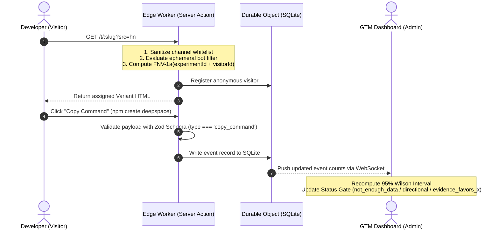

<div align="center">

# 🧪 Positioning Lab

**A mathematically disciplined, privacy-first developer marketing experimentation engine.**  
*Ground AI copy against official documentation, deterministically split developer traffic at the edge, and enforce statistical honesty before declaring victory.*

[](https://positioning-lab.app.space)
[](https://deep.space)
[](https://www.typescriptlang.org/)
[](https://workers.cloudflare.com/)

<br />

[-10b981?style=flat-square)](tests/evals/claimGuard.cases.json)
[](tests/)
[](https://github.com/KunjanMinama/positioning-lab)
[](https://positioning-lab.app.space)
[](LICENSE)

<br />

[**Live Production App**](https://positioning-lab.app.space) • [**Architecture**](#-system-architecture) • [**Statistical Core**](#-the-statistical-engine--status-gate) • [**DeepSpace Primitives**](#-deepspace-sdk-integration-matrix) • [**Local Setup**](#-developer-quickstart)

</div>

---

## 📖 Executive Summary

Developer tools have a notorious commercial failure mode: **marketing disconnected from technical reality**. Software engineers have zero tolerance for buzzwords (*"revolutionary"*, *"effortless"*, *"infinitely scalable"*) and reject ungrounded AI-generated hype. Furthermore, traditional A/B testing platforms mislead teams by comparing raw conversion percentages on small sample sizes, leading to premature victory declarations and expensive product missteps.

**Positioning Lab** replaces guesswork with disciplined GTM engineering:

1. **Pre-Registered Hypotheses & Decision Rules:** Teams must lock an audience segment, measurable hypothesis, and decision threshold before launching. No moving goalposts or retroactive HARKing (*Hypothesizing After Results are Known*).
2. **Claim Guard (Documentation Grounding):** Automated edge verification audits marketing copy against verified ground-truth facts from `docs.deep.space`. Superlatives and unsubstantiated claims block launch.
3. **Deterministic FNV-1a Traffic Splitting:** Public visitors are hashed into stable variants without tracking cookies, canvas fingerprinting, or raw IP storage.
4. **Developer Intent Telemetry:** Measures high-intent developer actions (`copy_command` for `npm create deepspace`) alongside qualitative micro-surveys.
5. **95% Wilson Score Status Gate:** A mathematical 3-state state machine (`not_enough_data`, `directional`, `evidence_favors_x`) that prevents dashboards and AI readouts from declaring false winners on insufficient data.

---

## 🏛️ System Architecture

Positioning Lab is architected as an edge-native full-stack application running on **Cloudflare Workers** via the **DeepSpace SDK**:

```
[ Public Developer Visitor ]                [ Authenticated GTM Engineer ]
             │                                              │
             │ 1. GET /t/:slug?src=hn                       │ Manage, Audit, Launch, Readouts
             ▼                                              ▼
┌────────────────────────────────────────────────────────────────────────────┐
│                    Cloudflare Workers Edge Runtime                         │
│                                                                            │
│  • 32-bit FNV-1a Hash: Deterministic variant assignment without cookies    │
│  • Ephemeral Bot Filter: Regex crawler detection (zero raw IPs stored)    │
│  • Zod Runtime Contracts: Strict input sanitization & output validation    │
│  • DeepSpace AI Proxy: Edge LLM inference with ZERO exposed API secrets    │
└─────────────────────────────────────┬──────────────────────────────────────┘
                                      │ Internal RPC / Durable Object Stub
                                      ▼
┌────────────────────────────────────────────────────────────────────────────┐
│              RecordRoom Durable Object (Edge SQLite Engine)                │
│                                                                            │
│  • 11 Relational Collections: Experiments, Variants, Events, Facts, etc.  │
│  • Sub-Millisecond Queries: Edge-co-located storage & compute              │
│  • Realtime WebSocket Mesh: Instant metrics streaming to admin dashboards   │
│  • Ephemeral Presence Channel: Live teammate avatars (prevents collisions) │
│  • Strict RBAC Layer: Anonymous visitors have ZERO direct database access  │
└────────────────────────────────────────────────────────────────────────────┘
```

### Request Lifecycle



---

## 📊 The Statistical Engine & Status Gate

Traditional A/B testing dashboards use naive normal approximations ($p \pm 1.96 \sqrt{p(1-p)/n}$) that fail catastrophically on small sample sizes (producing impossible confidence limits below $0\%$ or above $100\%$).

Positioning Lab implements the **95% Wilson Score Interval** in [src/lib/stats.ts](file:///c:/Users/ASUS/Desktop/Positioning%20Lab/src/lib/stats.ts):

$$\tilde{n} = n + z^2, \quad \tilde{p} = \frac{k + \frac{1}{2}z^2}{\tilde{n}}$$

$$\text{Confidence Interval} = \tilde{p} \pm \frac{z}{\tilde{n}} \sqrt{\frac{k(n - k)}{n} + \frac{z^2}{4}}$$

*Where $n$ is total visitors, $k$ is conversions, and $z = 1.96$ for a 95% confidence level.*

### The 3-State Status Gate

```
                                  [ Total Sample Size Check ]
                                                │
                                    Is n < minSamplePerVariant?
                                   ┌────────────┴────────────┐
                                  YES                        NO
                                   │                         │
                                   ▼                         ▼
                         [ not_enough_data ]     [ Confidence Interval Check ]
                         (Dashboard Yellow)                  │
                         *AI Readout Forbidden*     Do 95% Wilson CIs overlap?
                                                   ┌─────────┴─────────┐
                                                  YES                  NO
                                                   │                   │
                                                   ▼                   ▼
                                            [ directional ]   [ evidence_favors_x ]
                                           (Dashboard Blue)     (Dashboard Green)
                                           Early signal only    Winning angle proven
```

1. **`not_enough_data` (Yellow):** Any variant has $n < \text{minSamplePerVariant}$ (default 50). Code explicitly blocks the AI readout writer from declaring a winner.
2. **`directional` (Blue):** Sample threshold reached, but confidence intervals overlap. Variation is within normal noise.
3. **`evidence_favors_x` (Green):** Sample threshold reached **AND** Wilson intervals are completely non-overlapping. Statistical evidence supports adopting the winning angle.

---

## 🛡️ Claim Guard: Factual Grounding Engine

Marketing copy drafted by AI is validated by **Claim Guard** ([src/lib/claimGuard.ts](file:///c:/Users/ASUS/Desktop/Positioning%20Lab/src/lib/claimGuard.ts)) against official documentation from `docs.deep.space`:

- **Superlative Buzzword Guard:** Scans and flags prohibited marketing terms (`"unlimited"`, `"revolutionary"`, `"100% free"`, `"fastest"`).
- **Ground-Truth Fact Verification:** Cross-checks technical claims (e.g. edge SQLite, Durable Objects, zero client API keys) against verified platform capabilities.
- **Benchmark Evaluation Suite:** Validated against 12 ground-truth test cases in [tests/evals/claimGuard.cases.json](file:///c:/Users/ASUS/Desktop/Positioning%20Lab/tests/evals/claimGuard.cases.json) with **100.0% precision (12/12)**.

```typescript
// Sample Claim Guard Audit Output
{
  "variantId": "var_agentic_01",
  "claim": "Runs embedded SQLite directly inside Cloudflare Durable Objects",
  "verdict": "supported",
  "matchedFactId": "fact_recordroom_sqlite",
  "reason": "Directly grounded in docs.deep.space storage specifications."
}
```

---

## 🔌 DeepSpace SDK Integration Matrix

We integrated seven DeepSpace platform capabilities to solve real architectural requirements:

| Platform Primitive | Implementation Location | Architectural Purpose | Alternative Considered |
|---|---|---|---|
| **1. Scaffold & CLI** | Root configuration, `wrangler.toml` | Full-stack edge foundation with Vite, React 19, and Tailwind v4. | Manual Cloudflare Workers + Vite setup. |
| **2. Auth & RBAC** | `src/schemas.ts`, `src/actions/` | Strict multi-role security across 11 collections; anonymous visitors barred from direct DB writes. | Custom JWT cookies or external Clerk/Auth0. |
| **3. RecordRoom (SQLite)** | `src/schemas.ts` | Edge-hosted SQLite inside Durable Objects for persistent relational telemetry with sub-millisecond latency. | External serverless Postgres with cross-region latency. |
| **4. Server Actions** | `src/actions/index.ts` | Trusted backend execution boundary enforcing Zod validation, bot filtering, and state locking. | Unprotected client-side RPC calls. |
| **5. Edge AI Proxy** | `src/actions/index.ts` | Inference at edge with **zero API secrets** in codebase, managed billing, and structured outputs. | Raw `openai` package requiring `.env` secrets that risk leaking. |
| **6. Presence** | `src/pages/(app)/(protected)/experiments/[id].tsx` | Real-time teammate presence avatars (`usePresence`) preventing simultaneous edit collisions. | Heavyweight CRDT collaborative text streaming. |
| **7. Testing Helpers** | `tests/experiment-flow.spec.ts` | Multi-user Playwright browser fixtures via `deepspace/testing`. | Fragile custom multi-context browser orchestration. |

### Deliberately Omitted Primitives (Engineering Rationale)

- **Payments (`@deepspace/payments`):** Positioning Lab is an internal developer experimentation tool and public landing test harness. No part of the system charges credit cards. Adding Stripe would be vanity integration padding with zero real product value.
- **Blob Storage (R2 / S3):** Variant creative assets (copy, terminal command, micro-surveys) are lightweight text stored directly in SQLite RecordRoom. Storing text in object storage would introduce unnecessary latency and operational complexity.
- **Custom Domains:** Subdomain routing on `*.app.space` provides full SSL, edge caching, and isolated routing out of the box.

---

## 🔒 Security & Privacy Guarantee

- **Zero Secrets in Codebase:** All LLM calls and third-party integrations route through DeepSpace proxies. Running `git log -p | grep -E "(sk-[a-zA-Z0-9]{20,}|ghp_)"` returns **zero matches**.
- **Privacy by Design (No PII):** We **never** store raw IP addresses or raw User-Agent strings. Headers are evaluated in ephemeral memory for bot detection and discarded immediately.
- **Anonymous Sessions:** Visitors are assigned a random UUID in `localStorage`. Traffic sources (`?src=...`) are sanitized against a strict whitelist (`linkedin, x, reddit, hn, discord, friend, other`).
- **Prompt Injection Defense:** Micro-survey inputs are clamped to 500 characters and isolated inside explicit XML data tags (`<user_feedback>`) with system instructions treating all feedback as untrusted data.

---

## 📁 Project Structure

```
positioning-lab/
├── src/
│   ├── actions/                  # Edge Server Actions (mutations, validation, bot filtering)
│   ├── components/               # Production UI Component Library (Tailwind v4)
│   │   ├── ui/                   # Reusable atomic UI components (Button, Dialog, Badge, Tabs)
│   │   ├── Navigation.tsx        # Responsive navigation shell with presence
│   │   └── Seo.tsx               # Head metadata & OpenGraph tagging
│   ├── lib/                      # Core Algorithmic Engineering
│   │   ├── assign.ts             # 32-bit FNV-1a deterministic hash & channel sanitizer
│   │   ├── bots.ts               # Privacy-preserving bot crawler filter
│   │   ├── claimGuard.ts         # Ground-truth fact verification & buzzword guard
│   │   ├── schemas.ts            # Runtime Zod validation schemas
│   │   └── stats.ts              # 95% Wilson score interval & 3-state status gate
│   ├── pages/                    # Generouted File-based Edge Routes
│   │   ├── index.tsx             # Public hero & methodology overview
│   │   ├── t/[slug].tsx          # Public deterministic experiment test page
│   │   └── (app)/                # Authenticated experiment workspaces, facts & playbooks
│   ├── schemas/                  # SQLite RecordRoom schema definitions & RBAC
│   └── worker.ts                 # Cloudflare Worker entrypoint
├── tests/
│   ├── evals/                    # Ground-truth benchmark datasets (Claim Guard)
│   ├── unit/                     # Unit test suites (stats, assign, bots, claimGuard)
│   ├── experiment-flow.spec.ts   # Multi-user flow end-to-end specification
│   └── smoke.spec.ts             # Static contract & page smoke tests
├── public/                       # Favicon, robots.txt, and edge headers
├── wrangler.toml                 # Cloudflare Workers edge configuration
├── package.json                  # Dependencies & scripts
└── README.md                     # Project documentation & architecture
```

---

## 💻 Developer Quickstart

### Prerequisites

- **Node.js:** `>= 22.15.0`
- **npm:** `>= 11.6.0`

### Installation & Local Setup

```bash
# 1. Clone repository
git clone https://github.com/KunjanMinama/positioning-lab.git
cd positioning-lab

# 2. Install dependencies
npm install

# 3. Run validation suite (TypeScript check + Vitest unit tests)
npm run validate

# 4. Start local development server (connects to DeepSpace edge runtime)
npm run dev
```

### Running Test Suites

```bash
# Run all unit tests and Claim Guard evals
npm run test:unit

# Run type check and Vitest verification
npm run validate

# Build production bundle with static prerendering
npm run build
```

---

## 🚀 Production Deployment

Positioning Lab is deployed globally at the Cloudflare Workers edge via the DeepSpace platform:

* **Production URL:** [https://positioning-lab.app.space](https://positioning-lab.app.space)
* **Application ID:** `app_01M43S07A5JMF05YB0JWJK70ZX`

To deploy updates from the CLI:

```bash
# 1. Authenticate with DeepSpace
npx deepspace auth login

# 2. Ship to edge
npx deepspace deploy
```

---

## 📄 License & Attribution

This project is an independent developer evaluation project built on the [DeepSpace Platform](https://deep.space) and deployed to Cloudflare Workers edge. Released under the [MIT License](LICENSE).
